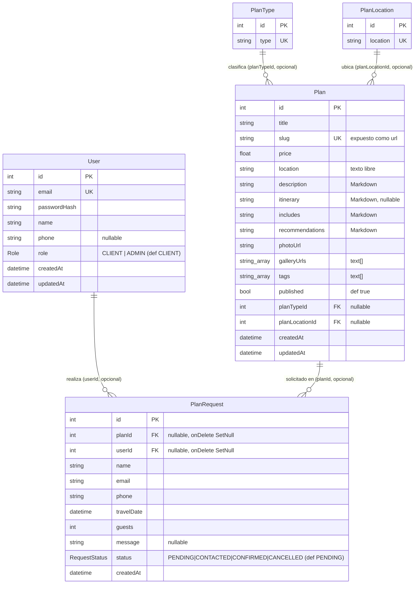

# Backend propio — Fase 0 (Scaffolding) + Fase 1 (Modelo + seed)

> Bitácora de la migración de Strapi → backend propio en Next.js + Postgres (Prisma).
> Plan completo en `~/.claude/plans/analiza-todo-este-proyecto-shimmying-lagoon.md`.
> Ejecutado: 2026-09-09.

## Resumen

Fundamentos del nuevo backend integrado en la app Next.js (`frontend/`): Prisma + Postgres,
modelo de datos mínimo (usuarios/auth, planes, solicitudes) y datos de ejemplo (seed). Todo
verificado contra un Postgres local en Docker; las variables de producción quedaron cableadas en
Railway para que el deploy funcione directo.

## Fase 0 — Scaffolding

### Dependencias (en `frontend/package.json`)
- Runtime: `@prisma/client`, `bcryptjs`, `jose`, `cloudinary`, `zod`, `react-markdown`, `remark-gfm`.
- Dev: `prisma`, `tsx`, `@types/bcryptjs`.
- **Prisma fijado a v6** (`6.19.3`). Se instaló v7 por defecto pero su nueva CLI-plataforma
  (`contract`/`db`/`orm`) es un cambio radical e inestable para el flujo `migrate`/`seed`; se hizo
  downgrade a v6 (flujo estándar y probado). Reevaluar v7 más adelante.

### Postgres de desarrollo (Docker)
Contenedor local para dev y para generar las migraciones (el `DATABASE_URL` interno de Railway solo
resuelve dentro de su red):
```
docker run -d --name pds-postgres -e POSTGRES_PASSWORD=postgres \
  -e POSTGRES_DB=puestadelsol -p 5433:5432 postgres:16
```

### Variables de entorno
- `frontend/.env` (dev, ya ignorado por `.gitignore` → `.env*`; confirmado que NO está en git):
  `DATABASE_URL` (Postgres local :5433), `JWT_SECRET`, `CLOUDINARY_NAME/KEY/SECRET` (reutilizadas de
  Railway), `ADMIN_EMAIL`, `ADMIN_PASSWORD`. Se dejó `STRAPI_HOST` (se elimina en Fase 2/6).
- **Railway (servicio `frontend`, env production)** — seteadas con `railway variable set ... --skip-deploys`
  (aditivas; no se tocaron aún las de Strapi, así el deploy actual sigue vivo):
  - `DATABASE_URL=${{Postgres.DATABASE_URL}}` (referencia; resuelve al Postgres interno del proyecto)
  - `DATABASE_SSL=false`
  - `JWT_SECRET` (nuevo, fuerte, distinto al de dev y al de Strapi)
  - `CLOUDINARY_NAME/KEY/SECRET` (copiadas del servicio Strapi `agencia-puesta-de-sol`)
  - `ADMIN_EMAIL=admin@puestadelsol.com`, `ADMIN_PASSWORD` (generada aleatoria — **ver más abajo**)

### Archivos nuevos
- `frontend/lib/db.ts` — singleton de `PrismaClient` (evita múltiples conexiones con el HMR de Next).
- `frontend/prisma/schema.prisma` — datasource Postgres + generator client.

### Cambios en `package.json` (scripts)
- `build`: `prisma generate && next build`
- `start`: `prisma migrate deploy && next start` (aplica migraciones en el arranque de producción,
  dentro de la red de Railway)
- `db:migrate` (`prisma migrate deploy`), `db:seed` (`tsx prisma/seed.ts`), `prisma:generate`
- Config `prisma.seed` → `tsx prisma/seed.ts`

## Fase 1 — Modelo de datos + seed

### Modelo (`prisma/schema.prisma`)

El esquema es intencionalmente pequeño: **usuarios/auth**, el **catálogo de planes** (con dos
taxonomías) y las **solicitudes** de plan. Provider `postgresql`; cliente `prisma-client-js`.

#### Diagrama entidad-relación



#### Enums
- `Role`: `CLIENT` | `ADMIN`.
- `RequestStatus`: `PENDING` | `CONTACTED` | `CONFIRMED` | `CANCELLED`.

#### Tablas (columnas y reglas)

**User** — cuentas (clientes y administradores).
- `id` PK autoincrement · `email` **único** (login) · `passwordHash` (bcrypt) · `name` ·
  `phone?` · `role` (def `CLIENT`) · `createdAt`/`updatedAt`.
- Relación: `1—N` con `PlanRequest` (un usuario puede tener muchas solicitudes).

**PlanType** — taxonomía "tipo de plan" (p.ej. Aventura, Playa). `type` **único**. `1—N` con `Plan`.

**PlanLocation** — taxonomía "ubicación/categoría". `location` **único**. `1—N` con `Plan`.

**Plan** — el catálogo (núcleo del sitio).
- `slug` **único** → el frontend lo expone como `url` y enruta `/planes/[slug]`.
- Textos enriquecidos en **Markdown**: `description`, `includes`, `recommendations` (requeridos) e
  `itinerary` (opcional).
- Media: `photoUrl` (portada) y `galleryUrls` como **array de texto** (`text[]`, URLs de Cloudinary/
  Unsplash, absolutas). `tags` también `text[]` (evita una tabla aparte).
- `published` controla la visibilidad pública (las lecturas del sitio filtran `published = true`).
- FKs **opcionales** `planTypeId`/`planLocationId` → borrar un tipo/ubicación deja el plan sin esa
  categoría (en el admin se desvincula antes de borrar).

**PlanRequest** — solicitud de un plan (reemplaza el antiguo "WhatsApp").
- **Abierta**: `userId?` es nullable (un invitado puede solicitar). Si hay sesión, se liga a la cuenta.
- `planId?` también nullable; ambas FKs con **`onDelete: SetNull`** para no perder la solicitud si se
  borra el plan o el usuario.
- Datos de contacto propios (`name`, `email`, `phone`) + `travelDate`, `guests`, `message?`.
- `status` gestionado desde el admin (flujo Pendiente → Contactado → Confirmado / Cancelado).

#### Notas de diseño
- Los arrays escalares (`galleryUrls`, `tags`) usan el tipo `text[]` nativo de Postgres — simple y
  suficiente para el alcance; si más adelante se necesita orden/relación por imagen, se migrarían a
  tablas propias.
- Todas las relaciones plan↔taxonomía y solicitud↔(plan/usuario) son **opcionales** a propósito, para
  que borrar catálogo/usuarios nunca rompa integridad ni elimine solicitudes en cascada.

Migración inicial: `prisma/migrations/20260909200326_init/` (aplicada al Postgres local; en producción
se aplicó en la Fase 6).

### Seed (`prisma/seed.ts`, idempotente)
- 1 admin (upsert por email, password hasheada con bcrypt, rol ADMIN).
- 4 tipos (Aventura, Cultural, Playa, Ecoturismo) y 4 ubicaciones (Cabo de la Vela, Punta Gallinas,
  Riohacha, Palomino).
- 4 planes de ejemplo (upsert por slug) con contenido Markdown curado (Guajira) e imágenes de Unsplash
  (dominio permitido en `next.config.ts`).

## Verificación
- `prisma migrate dev --name init` → OK, esquema en sync, cliente generado.
- `pnpm db:seed` → `✔ Admin, ✔ 4 tipos/4 ubicaciones, ✔ 4 planes`.
- Conteos en BD: users 1, plans 4, types 4, locations 4, requests 0. Admin con rol ADMIN; planes con
  tags y galería poblados.
- Railway: `railway variables --service frontend` confirma `DATABASE_URL` resuelto al Postgres interno.

## Notas / pendientes
- **Credenciales admin de producción**: email `admin@puestadelsol.com`; la contraseña se generó al
  azar y está en la variable `ADMIN_PASSWORD` del servicio frontend en Railway. Cambiarla tras el
  primer login (cuando exista el panel admin en Fase 5).
- El seed de producción se corre una vez en Fase 6 (`railway run --service frontend pnpm db:seed`).
- Warning de Prisma: `package.json#prisma` está deprecado para v7; en v6 funciona. Migrar a
  `prisma.config.ts` si se sube a v7.
- Las tablas nuevas conviven con las de Strapi en el mismo Postgres; las de Strapi se dejan caer en Fase 6.
- Próximo: **Fase 2** (reescribir `lib/get-*.ts` a Prisma conservando las formas, contenido fijo de
  home/social/phone/gallery, y `PlanTabs` de blocks → Markdown).
